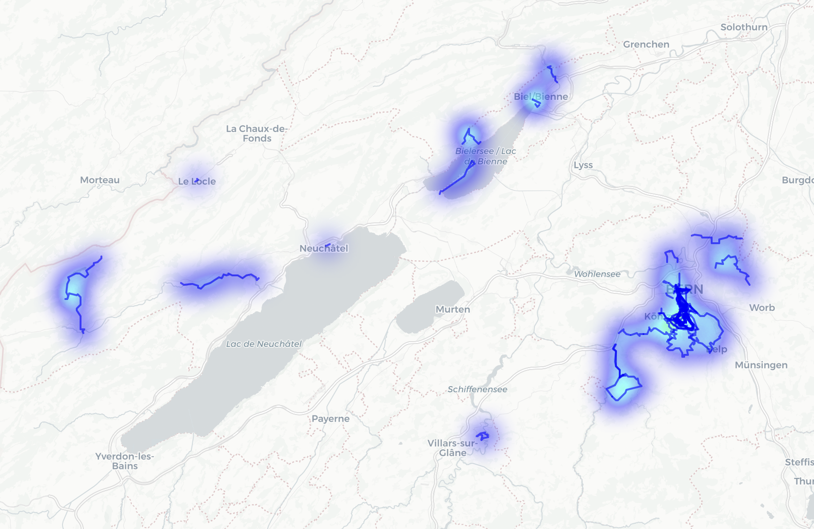

# Tools for Apple Health export

A collection of Python tools to extract, process, and visualize workout GPS data from Apple Health exports, creating interactive route maps and heatmaps of your activities.



## Features

- Extract GPS data from Apple Health workout route files (GPX format)
- Process health metrics from Apple Health export XML
- Generate interactive maps with:
  - Individual workout route traces
  - Heatmap overlay showing frequently traversed areas
  - Customizable visualization parameters

## Installation

1. Clone the repository:
```bash
git clone https://github.com/kanapitsas/apple-health-tools.git
cd apple-health-tools
```

2. Install required dependencies:
```bash
pip install pandas folium tqdm
```

## Usage

### 1. Data Extraction

#### Extract GPX Routes
```bash
python extract/gpx_routes.py
```
This script processes all GPX files from your Apple Health export and combines them into a single CSV file (`gpx_data.csv`).

#### Extract Health Records
```bash
# List all available metrics in your health export
python extract/health_records.py --list

# Export specific metrics (e.g., heart rate data)
python extract/health_records.py --type HKQuantityTypeIdentifierHeartRate --output heartrate.csv
```

### 2. Visualization

Create an interactive map of your workout routes:

```bash
python visualize/plot_routes.py --input gpx_data.csv --output workout_map.html
```

#### Visualization Options

- `--sample-rate`: Simplify routes by taking every nth point (default: 10)
- `--heatmap-sample`: Sample rate for heatmap data (default: 20)
- `--blur`: Blur radius for heatmap (default: 20)
- `--radius`: Point radius for heatmap (default: 15)
- `--opacity`: Minimum opacity for heatmap (default: 0.3)

Example with custom parameters:
```bash
python visualize/plot_routes.py --input gpx_data.csv --sample-rate 20 --blur 15 --radius 10
```

## Data Requirements

### Apple Health Export

1. Open the Health app on your iPhone
2. Tap your profile picture
3. Select "Export All Health Data"
4. Extract the resulting zip file
5. Place the export files in an `apple_health_export` directory:
   - GPX files should be in `apple_health_export/workout-routes/`
   - The main export XML should be at `apple_health_export/export.xml`

## Output

The visualization tool generates an HTML file containing an interactive map with:
- Blue lines showing individual workout routes
- A heatmap overlay indicating frequently visited areas
- The ability to zoom and pan
- Optional base map selection
